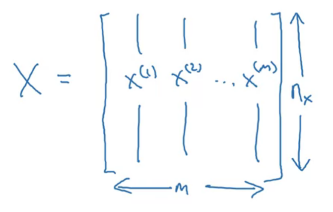
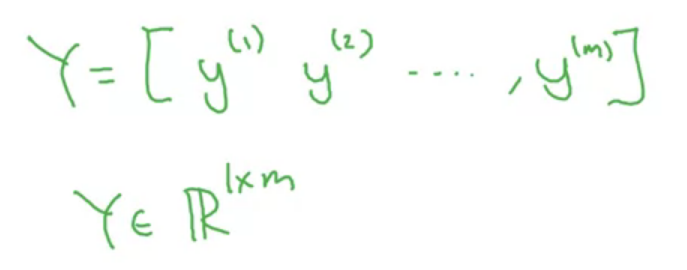
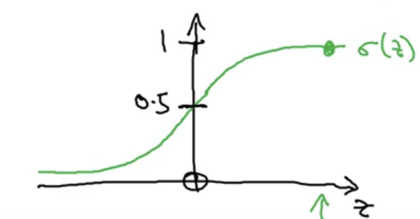
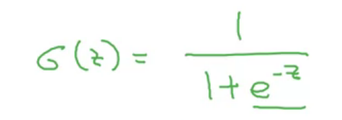
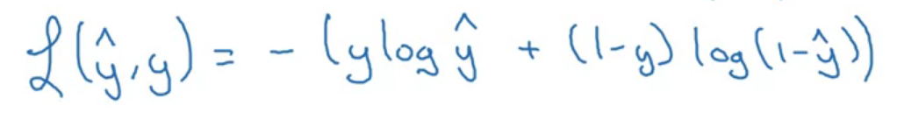
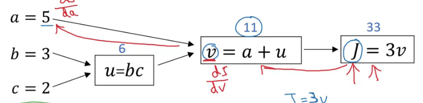

# 专业术语

## ReLU: Rectified Linearar Unite （线性整流函数）

类似前面平坦的直线，后面有斜率的直线

## 变量m

指代amount of labeled data

## 神经网络和机器学习间的区别

在更多数据集上能发挥出更好的作用。

## 变量n

输入特征向量x的维度

## sigmoid

## loss function

The <b>loss function </b> computes the error for a `single` training example; the <b> cost function </b> is the `average` of the loss functions of the entire training set.

## 正向传播与反向传播

正向传播就是按照规则依次往后计算，反向传播往前计算导数（计算出目标结果相对于输入参数的导数[偏导]）

