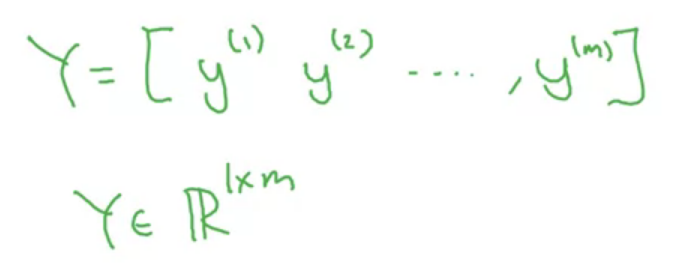
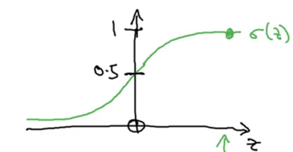
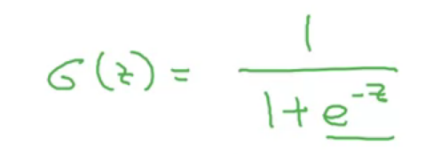
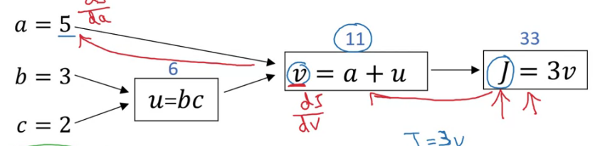

# 专业术语

## ReLU: Rectified Linearar Unite （线性整流函数）

类似前面平坦的直线，后面有斜率的直线

## 变量m

指代amount of labeled data

## 神经网络和机器学习间的区别

在更多数据集上能发挥出更好的作用。

## 变量n

输入特征向量x的维度

## sigmoid

the output of a neuron is a = g(Wx + b) where g is the activation function (sigmoid, tanh, ReLU, ...)

## loss function

The <b>loss function </b> computes the error for a `single` training example; the <b> cost function </b> is the `average` of the loss functions of the entire training set.

## 正向传播与反向传播

正向传播就是按照规则依次往后计算，反向传播往前计算导数（计算出目标结果相对于输入参数的导数[偏导]）

## 梯度下降

α：learning rate

实际计算过程中，由于具有m个输入值，dw应该相加求平均。

## Vectorization

Whenever possible, aviod explicit for-loops

使用矩阵计算（使用了并行运算）

矩阵的排列方式很重要：不同的entry（x）以行的形式分布，同一个数据中的特征以列的形式分布。

## broadcasting

行和列必须要至少有一项相同才能broadcasting，或者某个变量为单个的数字。

/=或者+=等方式不支持broadcasting

# 实用函数

* np.dot()		矩阵相乘
* np.exp()        矩阵加上指数
* np.log() 	np.abs()	np.max()     np.sum()	v**2
  * axis = 0 按照列（vertical）的方向计算（对特征进行计算）
* np.random.randn(5, 1) 不要忽略后面一个参数
* np.linalg.norm(x, axis=1, keepdims=True) 正则化函数

# Tip

(m_train, num_px, num_px, 3)的矩阵使用reshape的时候，使用(m_train, -1).T 而不要直接(-1, m_train)

## pre-processing

- Figure out the dimensions and shapes of the problem (m_train, m_test, num_px, ...)
- Reshape the datasets such that each example is now a vector of size (num_px * num_px * 3, 1)
- "Standardize" the data

## steps for building a Neural Network

1. Define the model structure (such as number of input features)
2. Initialize the model's parameters
3. Loop:
   - Calculate current loss (forward propagation)
   - Calculate current gradient (backward propagation)
   - Update parameters (gradient descent)
