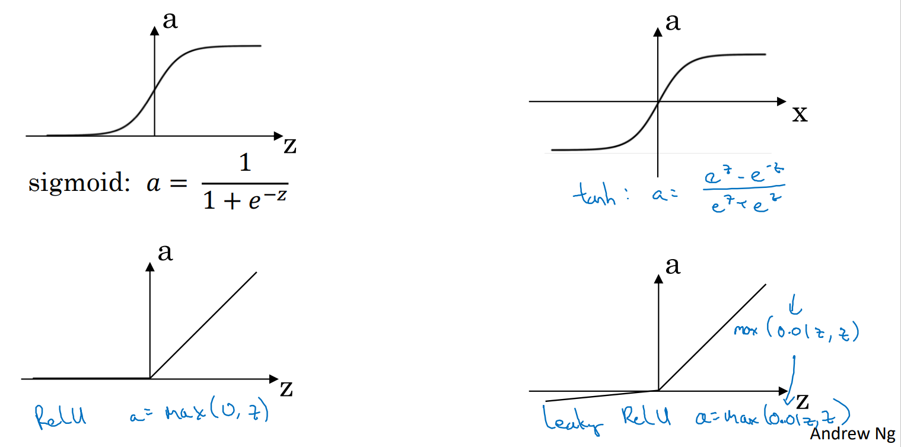

# 专业术语

## 神经网络 Neural Network

神经网络其实就是同一个方法的多次迭代？

hidden layer的shape = [当前层次个数， 前一层个数] ？

把上一层神经元的结果当成x进行下一层神经元的计算（导致每层的特征数量不一样）

（input and output）矩阵的纵向（第一维）代表隐藏单元，横向表示数据样本个数 【X, Z, A, Y】(PS. a0的隐藏单元数量等于x的特征数量) 

(parameter)矩阵和上述情况不一样，不受数据样本个数影响 【W, B】

## 激活函数 Activation function

sigmoid (binary classification) [0~1]

tanh [-1~1]

ReLU [0~+∞]

## L 

number of layers (输入层为layer 0)

## n

num of node in a layer

# Tip

## 可以使用for loop的地方

1. 多次迭代
2. 内部的多个隐藏层
