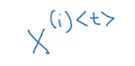
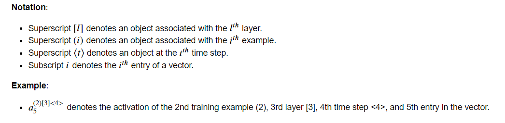
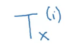
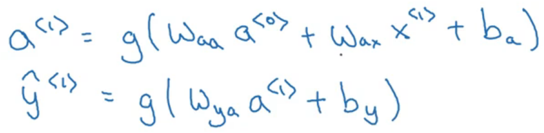
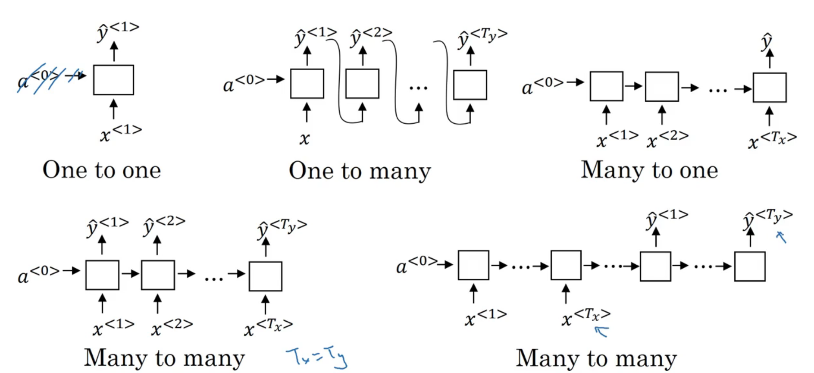
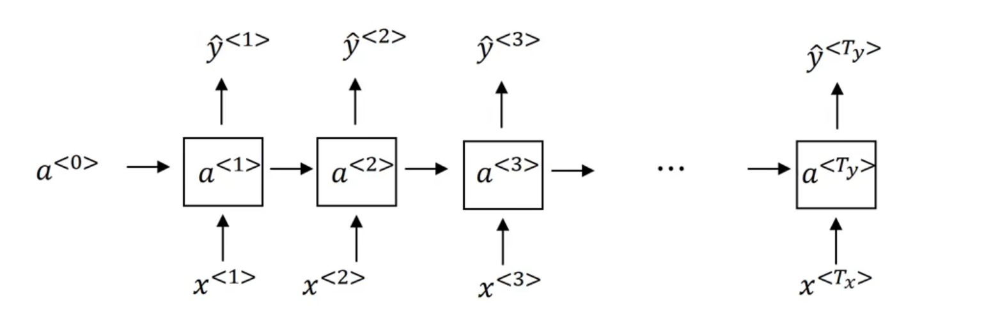
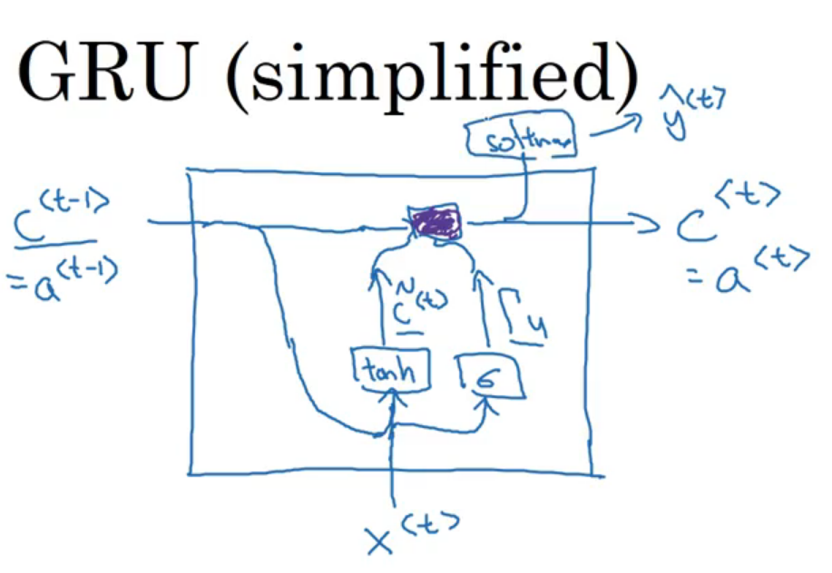
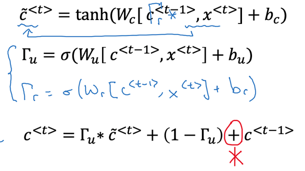
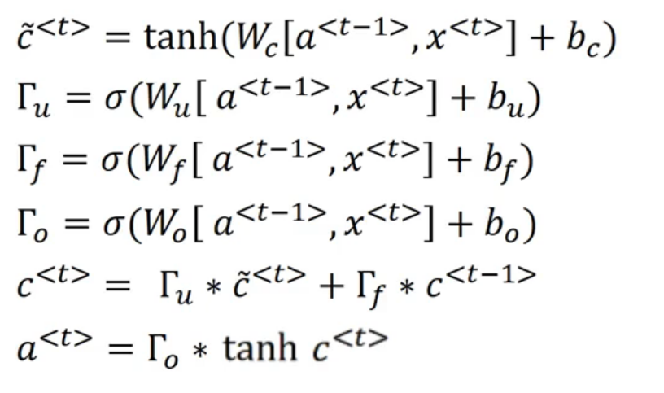

# 专业术语

## 第i个训练样本的第t个单词

## 第i个训练样本的长度

## RNN

## 架构

## RNN 语言模型

## GRU

gamma (Γ)表示我们又多大程度想要改变之前的memory cell (C)中存储的值

C等同于上图中RNN计算出的a

tanh 和 sigmoid中间的式子得到的结果一般很小，负数。

## LSTM

## 新的训练流程

- forward pass,
- cost computation,
- backward pass,
- (optional) clip, [np.chip()]
- parameter update.

## word2vec

skip-gram: content word with random choice target in a range.

# 疑问

怎么训练语言模型呀？
