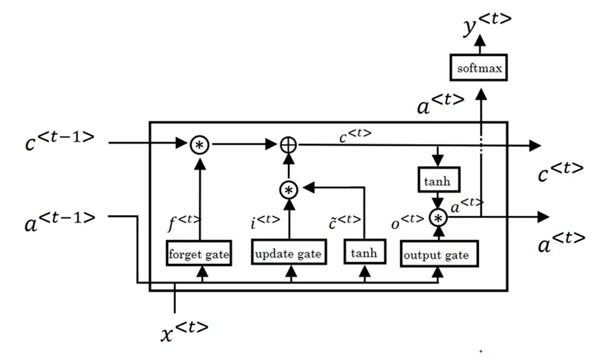

# 专业术语

## 第i个训练样本的第t个单词

## 第i个训练样本的长度

## RNN

## 架构

## RNN 语言模型

## language model 语言模型

语言模型其实就是看一句话是不是正常人说出来的正常的话

![[公式]](https://www.zhihu.com/equation?tex=P%28w_1%2Cw_2%2C...%2Cw_m%29%3DP%28w_1%29P%28w_2%7Cw_1%29P%28w_3%7Cw_1%2Cw_2%29...P%28w_m%7Cw_1%2Cw_2%2C...%2Cw_%7Bm-1%7D%29+%5C%5C)	

改进：
	![[公式]](https://www.zhihu.com/equation?tex=n)元模型(n-gram model)

机器翻译、语音识别得到若干候选之后，可以利用语言模型挑一个尽量靠谱的结果。

## GRU

gamma (Γ)表示我们有多大程度想要改变之前的memory cell (C)中存储的值 

C等同于上图中RNN计算出的a

tanh 和 sigmoid中间的式子得到的结果一般很小，负数。

（两个gate: update gate and relevant gate here）

## LSTM

将c和a进行分割，c用两个门进行更新，a用当前的c来进行计算。

## 新的训练流程

- forward pass,
- cost computation,
- backward pass,
- (optional) clip, [np.chip()]
- parameter update.

## word2vec

skip-gram: content word with random choice target in a range.

# 疑问

怎么训练语言模型呀？
