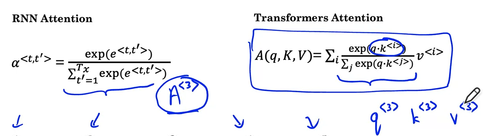
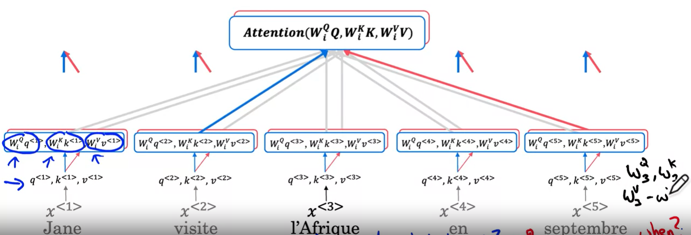
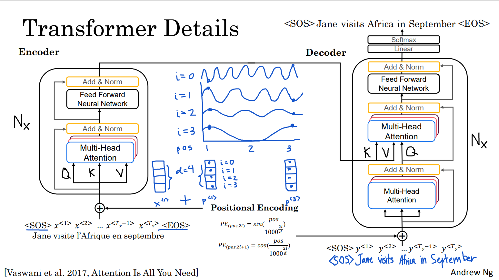
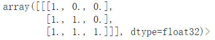

# Self-Attention

q: Question
k: Key
v: Value

Q*K：how good is this key (eg. "Jane") an answer to the question
		    表示当前的q和每个word（key）之间的关联程度。（相加总和为1）

v：各自的相关程度（Q和K来表示，且相加为1）乘以各自自己的value

# Multi-Head Attention

Head: each time  calculate the self attention for sequence

Multi-Head: 
	multiple question: multiple q for a single word
	q, k, a 不变，但是都额外加了参数Wiq, Wik, Wia
	每个head中，最佳关联程度的词语可能不一样	

# Positional Encoding

create another vector p <i> with the same dimension with the embedding vector

通过sin & cos的一些关系表达式，从独特的embedding vector中提取出另一个独特的vector，且此vector只与词的position相关。将与原本的语义embedding合作表示新的embedding。

# Mask

## Padding Mask

1. 将input sentence削减或填充至相同的长度
2. 构造mask vector，1表示为attend， 0表示为ignore
3. 将mask vector 为0的向量变为infinite（避免对SoftMax造成影响）

## Look-ahead Mask

​			

# 疑问

两种padding同时使用

